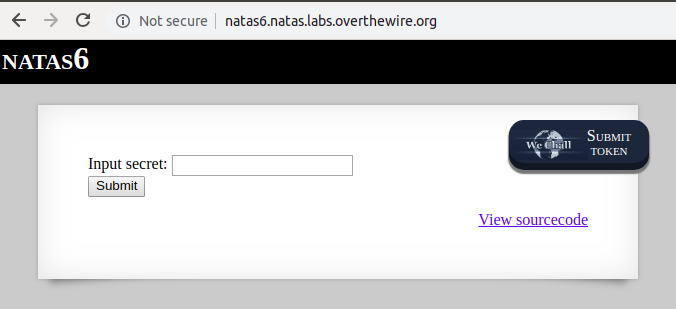

# Level 5-6

LINK : http://natas6.natas.labs.overthewire.org/




Here is the View Source code thing :

```html

<html>
<head>
<!-- This stuff in the header has nothing to do with the level -->
<link rel="stylesheet" type="text/css" href="http://natas.labs.overthewire.org/css/level.css">
<link rel="stylesheet" href="http://natas.labs.overthewire.org/css/jquery-ui.css" />
<link rel="stylesheet" href="http://natas.labs.overthewire.org/css/wechall.css" />
<script src="http://natas.labs.overthewire.org/js/jquery-1.9.1.js"></script>
<script src="http://natas.labs.overthewire.org/js/jquery-ui.js"></script>
<script src=http://natas.labs.overthewire.org/js/wechall-data.js></script><script src="http://natas.labs.overthewire.org/js/wechall.js"></script>
<script>var wechallinfo = { "level": "natas6", "pass": "<censored>" };</script></head>
<body>
<h1>natas6</h1>
<div id="content">

<?

include "includes/secret.inc";

    if(array_key_exists("submit", $_POST)) {
        if($secret == $_POST['secret']) {
        print "Access granted. The password for natas7 is <censored>";
    } else {
        print "Wrong secret";
    }
    }
?>

<form method=post>
Input secret: <input name=secret><br>
<input type=submit name=submit>
</form>

<div id="viewsource"><a href="index-source.html">View sourcecode</a></div>
</div>
</body>
</html>
```

I see `==` comparison which is a big joke

However let's try simple way, by accessing http://natas6.natas.labs.overthewire.org/includes/secret.inc

```html
<?
$secret = "FOEIUWGHFEEUHOFUOIU";
?>

```

Here is the flag :D


But this doesn't work as flag, but as secret param

which returns 


```html

Access granted. The password for natas7 is 7z3hEENjQtflzgnT29q7wAvMNfZdh0i9

```


 

 